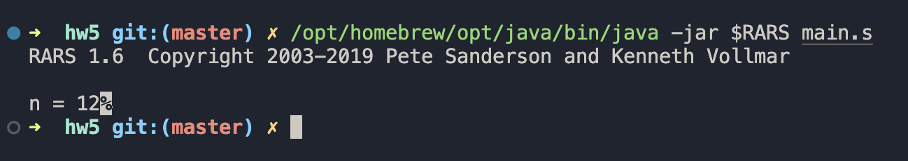
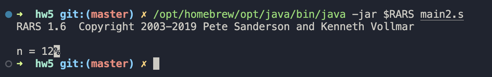

# АВС №5, Печенев Платон. БПИ2310

## Решение циклом

Вычисляется n!, затем n = n+1 и вычисляется (n+1)!

Если $\frac{(n+1)!}{n!} \ne n+1$, то мы вышли за 32 бита. Печатаем n и завершаем программу.

[Код программы (цикл)](./main.s)

## Решение рекурсией

Здесь n! вычисляется на основе (n-1)!, полученного с помощью вызова рекурсивного вызова подпрограммы. Внутри этой подпрограммы в стек кладутся регистры `ra`, `s0`, `s1`, а по завершении восстанавливаются.

[Код программы (рекурсия)](./main2.s)

